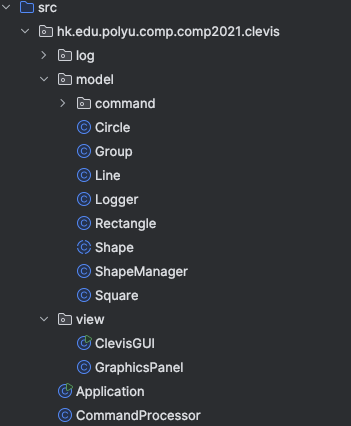

# CLEVIS — Command Line Vector Graphics Software

> COMP2021 Object-Oriented Programming | Fall 2025 | Group 19  
> The Hong Kong Polytechnic University

A Java-based command-line tool that allows users to create, modify, and manage 2D vector shapes in a Cartesian coordinate system, complete with a graphical user interface (GUI), logging, and undo/redo support.

---

## 👥 Team Members

| Name | Student ID |
|---|---|
| Kwan Tsz Chun Ambrose | 24090XXXD |
| Ng Yik Chun | 2408XXXD |
| Kan Cheuk Wang | 24074XXXD |
| Kwan Cheuk Yiu | 24079XXXD |

---

## 📌 Features

### Core Shapes
- **Rectangle** — defined by position and dimensions
- **Square** — extends Rectangle with equal sides
- **Circle** — defined by center and radius
- **Line** — defined by two endpoints
- **Group** — groups multiple shapes into a single manageable unit

### Shape Operations
- `rectangle <name> <x> <y> <w> <h>` — Create a rectangle
- `square <name> <x> <y> <side>` — Create a square
- `circle <name> <cx> <cy> <r>` — Create a circle
- `line <name> <x1> <y1> <x2> <y2>` — Create a line
- `group <groupName> <shape1> <shape2> ...` — Group shapes together
- `ungroup <groupName>` — Dissolve a group back to individual shapes
- `delete <name>` — Remove a shape or group
- `move <name> <dx> <dy>` — Translate a shape by offset
- `boundingbox <name>` — Get the minimum bounding box `[x, y, w, h]`
- `pick-and-move <x> <y> <dx> <dy>` — Move the topmost shape at a given point
- `intersect <name1> <name2>` — Check if two shapes intersect
- `list <name>` — Display details of a specific shape
- `listall` — Display all shapes ordered by Z-order (newest first)
- `undo` — Undo the last operation
- `redo` — Redo the last undone operation
- `quit` — Exit the program (flushes logs before exit)

---

## 🖥️ Graphical User Interface (GUI)

CLEVIS includes a Swing-based GUI built with two main classes:

- **`ClevisGUI`** — Manages overall layout: command input area (top), canvas (middle), and command history (bottom). Delegates command processing to the CLI's `CommandProcessor`.
- **`GraphicsPanel`** — Extends `JPanel` and overrides `paintComponent()`. Renders all shapes using `java.awt.geom` classes (`Rectangle2D`, `Ellipse2D`, `Line2D`). Supports **zoom in**, **zoom out**, and **reset view**.

---

## 📂 Project Structure

---

## 🚀 Getting Started

### Prerequisites
- Java JDK 11 or above
- IntelliJ IDEA (recommended) or any Java IDE

### Running the Project

1. Clone the repository:
   ```bash
   git clone https://github.com/Joe4NYC/COMP2021-ClevisProject.git
   ```

2. Open the project in IntelliJ IDEA.

3. Run `Application.java` as the main entry point.

4. Interact via the command-line input or the GUI window.

### Logging

All commands and outputs are automatically logged to:
- `log.txt` — plain text format
- `log.html` — HTML-formatted log

Logs persist during the session and are flushed on `quit`.

---

## 🏗️ Design

### OOP Architecture

- `Shape` is an **abstract class** serving as the blueprint for all shape types.
- Each shape implements `getBoundingBox()`, `move()`, `intersect()`, and `describe()`.
- `Group` recursively delegates operations to its member shapes.
- `ShapeManager` stores all shapes in a `HashMap<String, Shape>` and maintains a **Z-order list**.

### Design Patterns Used

- **Template Method** — Abstract `Shape` class defines the structure; subclasses override specifics.
- **Command Pattern** — Each undoable operation is encapsulated as a command object with `execute()` and `undo()` methods, stored on an **undo stack**; a **redo stack** is maintained accordingly.

---

## ⚠️ Error Handling

| Scenario | Error Message |
|---|---|
| Duplicate shape name | `Name already used: <name>` |
| Shape not found | `Shape not found: <name>` |
| Ungroup non-group | `<name> is a shape, not a group` |
| Empty undo stack | `Nothing to undo.` |
| Empty redo stack | `Nothing to redo.` |
| Missing log file path | `Cannot create log files: <reason>` |
| Invalid / non-numeric input | Command rejected with error message |

---

## 📜 License

This project was developed for academic purposes as part of COMP2021 at PolyU. Not intended for commercial use.
